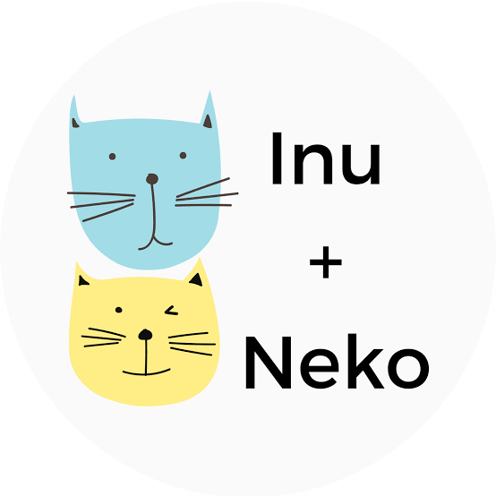

# Inu-Neko-Exploratory-Analysis-Python
Inu+Neko are a pet supply and services company that just started an e-commerce business. 

Inu and Neko had a lot of success with a marketing campaign and is seeing a lot of growth. The company wants to know how these new incoming customers differ from their past consumers. Are there different The stakeholders wants to know if there are different items they should stock more of and other things they should consider.

## Exploring Inu+Neko Sales Data
The data provided has been cleaned up. They are the sales numbers for Inu+Neko over a 6 month period. 

In the Exploratory Analysis pdf, the following questions were answered to get insights from the sales data using the jupyter notebook:

- How many transactions are there?
- Which days were the first and last transactions?
- Which animal product type is more popular?
- What was the total dollar amount made in the month of June?
- What is the average number of items bought in each transaction?
- What are the top ten products by the number of sales? Display in descending order.
- What are the top ten products by revenue? Display in descending order.
- How many customers are returning?

## Skills and Tools Used 
- Python 
- Jupyter Notebook 

## Libraries Used 
- Numpy
- Pandas

